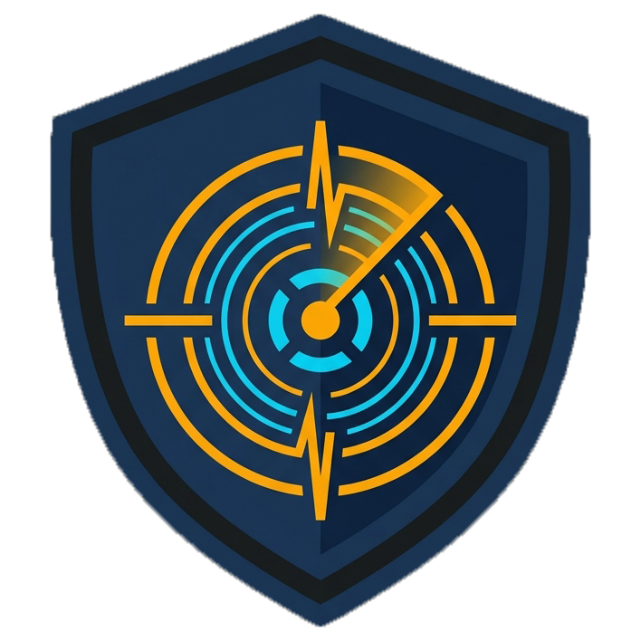
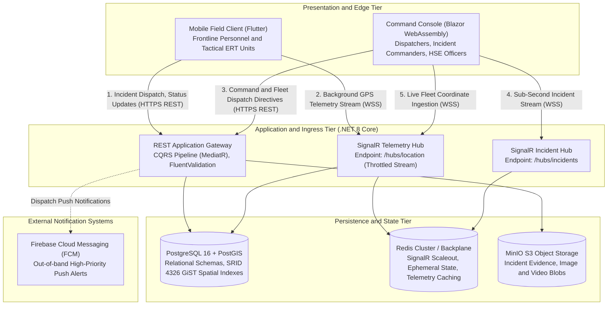
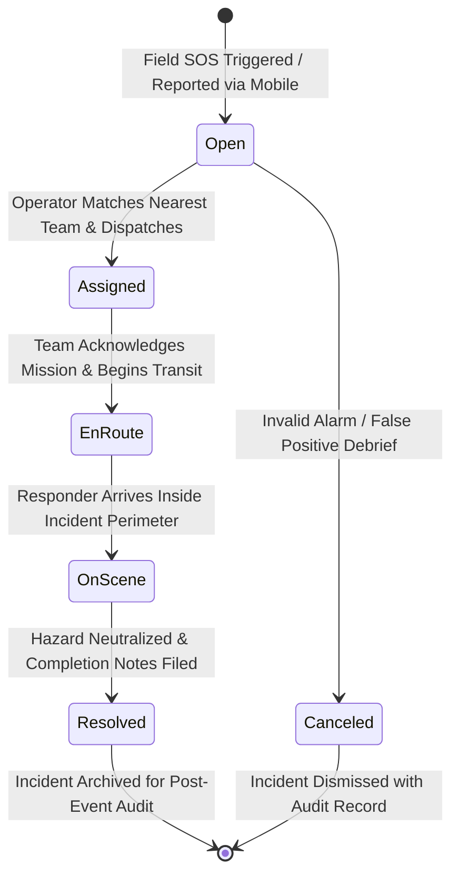
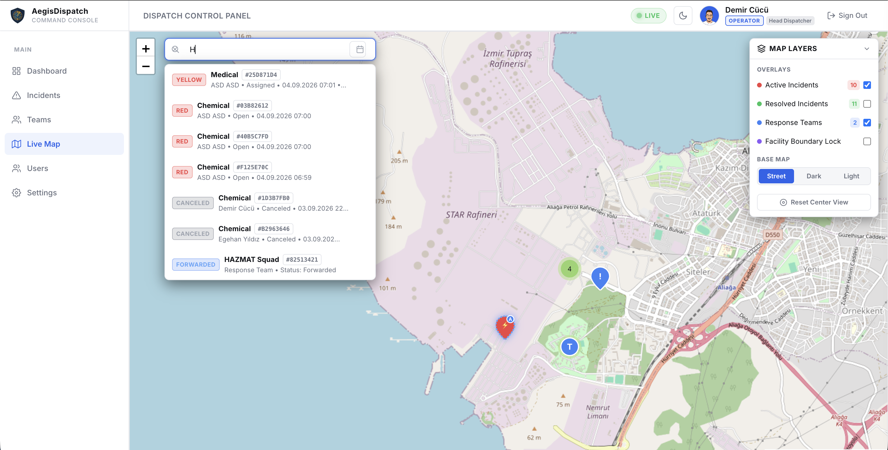
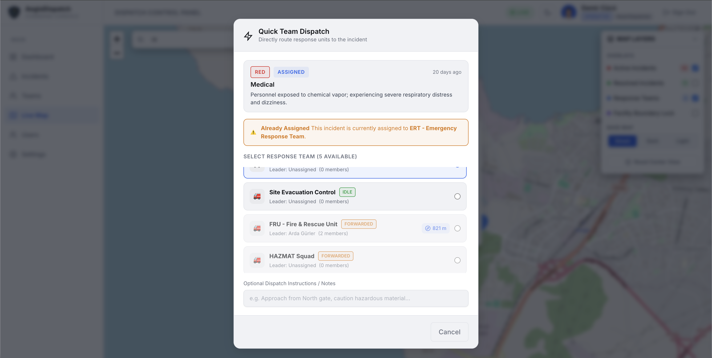
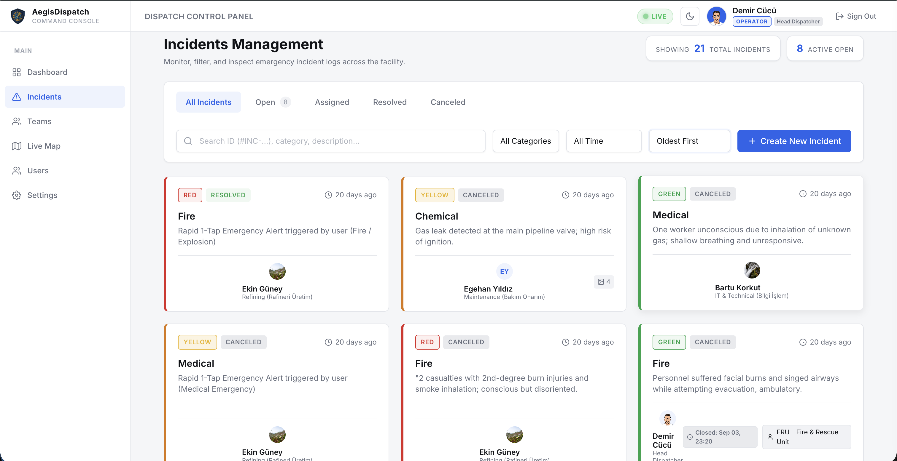
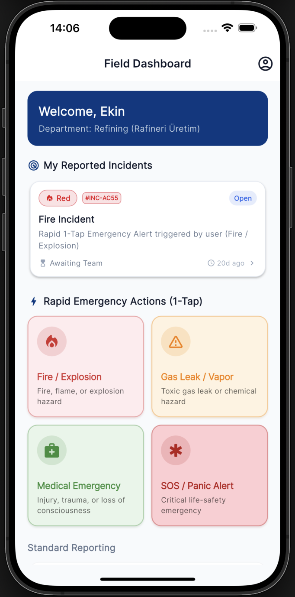
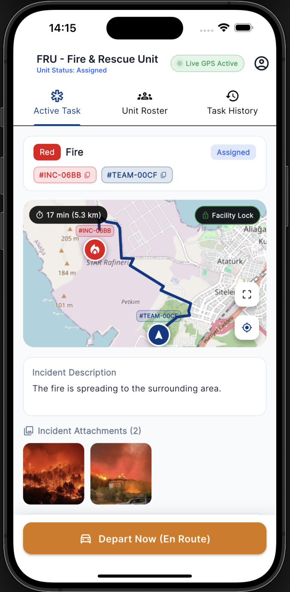
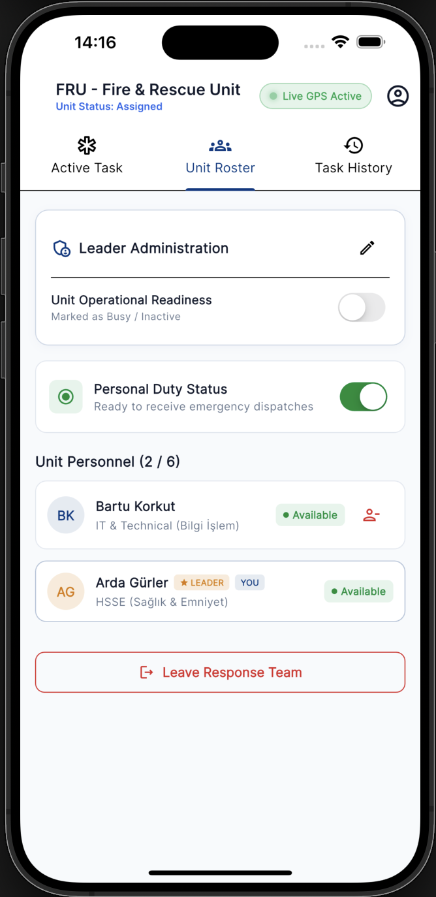

<p align="center">
  
</p>

<h1 align="center">AegisDispatch: Industrial Emergency Management and Geospatial Telemetry Platform</h1>

<p align="center">
  <a href="https://github.com/Decuayer/aegis-dispatch/actions/workflows/backend-ci.yml">
    
  </a>
  <a href="https://github.com/Decuayer/aegis-dispatch/actions/workflows/mobile-ci.yml">
    
  </a>
  
  
  
  
</p>

AegisDispatch is an enterprise-grade incident response, real-time spatial telemetry, and fleet coordination platform architected for high-consequence industrial facilities, including petrochemical processing plants, refineries, offshore installations, and chemical manufacturing complexes.

The system bridges frontline personnel, Emergency Response Teams (ERT), and central command dispatchers into a synchronized, sub-second telemetry network. It guarantees rapid incident reporting, automated spatial proximity matching, dynamic team leadership governance, and resilient field operations under degraded network conditions.

---

## 1. System Architecture and Engineering Design

AegisDispatch is engineered in accordance with Clean Architecture and Command Query Responsibility Segregation (CQRS) patterns on .NET 8. The persistence, caching, and streaming layers are designed for high availability, transactional consistency, and geospatial indexing.

### 1.1 Architecture Topology



### 1.2 Architectural Layers

1. **Domain Layer (`AegisDispatch.Domain`)**: Contains enterprise domain entities (`Incident`, `Team`, `User`, `Assignment`, `Feedback`), domain events, aggregate roots, value objects, and domain-level enumerations. Free of external framework dependencies.
2. **Application Layer (`AegisDispatch.Application`)**: Implements application use cases utilizing MediatR for CQRS. Commands handle state mutations with transactional integrity; Queries optimize projection models using EF Core `AsNoTracking()` streams. FluentValidation enforces boundary invariants.
3. **Infrastructure Layer (`AegisDispatch.Infrastructure`)**: Realizes concrete adapters for database persistence (Entity Framework Core with Npgsql), PostGIS spatial operators, Redis caching backplane, MinIO S3 object storage clients, and Firebase Cloud Messaging (FCM) push dispatchers.
4. **Presentation & API Tier (`AegisDispatch.API`)**: ASP.NET Core 8 Web API host exposing OpenAPI/Swagger specifications, JWT authentication, role-based authorization filters, global exception middleware, and SignalR WebSocket hubs.
5. **Operator Web Console (`AegisDispatch.Web`)**: Blazor WebAssembly single-page application integrating interactive Leaflet.js GIS map rendering, real-time audio-visual triage boards, and tactical dispatch modals.
6. **Mobile Field Client (`clients/mobile`)**: Flutter client targeting Android and iOS, compiled to native code. Integrates background geolocation daemons, offline SQLite/state queues, dynamic OSRM navigation, and local cryptographic token stores.

### 1.3 Geospatial Telemetry and Spatial Indexing

Geographic coordinates are normalized to the **WGS 84 (SRID 4326)** standard. Point geometries are mapped natively using NetTopologySuite types (`NetTopologySuite.Geometries.Point`).

```
Point: SRID=4326; Point(Longitude, Latitude)
```

#### GiST (Generalized Search Tree) Indexing
High-frequency geospatial queries rely on PostGIS GiST spatial indexing on the `Location` geometry columns of both `Incidents` and `Teams` tables:

```sql
CREATE INDEX "IX_Incidents_Location" ON "Incidents" USING GIST ("Location");
CREATE INDEX "IX_Teams_Location" ON "Teams" USING GIST ("Location");
```

GiST indexes implement R-Tree data structures, grouping adjacent spatial features into hierarchical bounding boxes (Minimum Bounding Boxes - MBR). This provides:
* $O(\log N)$ bounding-box search complexity for active facility perimeter queries.
* Rapid candidate exclusion before executing expensive geodesic distance calculations.
* Sub-millisecond execution times for radius queries across dense personnel deployments.

### 1.4 Real-Time Streaming and Redis Scale-Out

Bidirectional communication is handled via ASP.NET Core SignalR. In multi-instance or containerized environments, horizontal scaling is achieved via a Redis backplane (`Microsoft.AspNetCore.SignalR.StackExchangeRedis`), ensuring message delivery across decoupled web nodes.

#### Location Stream Concurrency Throttling
To protect database write bandwidth and client rendering pipelines from coordinate flooding, `LocationHub` implements a sliding-window rate limiter per team/responder:

```csharp
private static readonly ConcurrentDictionary<Guid, DateTime> _lastUpdateTimes = new();
private const int ThrottleMs = 1000;

public async Task StreamTeamLocation(Guid teamId, double lat, double lng)
{
    var now = DateTime.UtcNow;
    if (_lastUpdateTimes.TryGetValue(teamId, out var last) && (now - last).TotalMilliseconds < ThrottleMs)
    {
        return; // Suppress updates exceeding 1Hz per entity
    }

    _lastUpdateTimes[teamId] = now;
    var payload = new { teamId, lat, lng, timestamp = now };
    await Clients.All.SendAsync("TeamLocationUpdated", payload);
}
```

### 1.5 Incident Lifecycle State Machine



---

## 2. Technology Stack

| Domain | Technology | Version | Purpose |
| :--- | :--- | :--- | :--- |
| **Backend Framework** | .NET Core | 8.0 | High-performance, cross-platform runtime for API and event pipelines |
| **Architectural Model** | Clean Architecture / CQRS | MediatR 12.x | Decoupled domain commands, queries, and notification pipelines |
| **Database Engine** | PostgreSQL | 16.x | Relational ACID persistence engine |
| **Spatial Engine** | PostGIS | 3.4+ | Geospatial data types, GiST indexing, distance algorithms |
| **ORM / Data Access** | Entity Framework Core | 8.0 (Npgsql) | Object-relational mapping with native NetTopologySuite spatial provider |
| **Real-Time Messaging** | ASP.NET Core SignalR | 8.0 | Low-latency WebSocket connections for telemetry and alarm feeds |
| **Distributed Backplane** | Redis | 7.x Alpine | Pub/Sub messaging backplane and ephemeral coordinate cache |
| **Object Storage** | MinIO | S3-Compatible | On-premise, highly durable storage for incident evidence media |
| **Push Notifications** | Firebase Admin SDK | 3.0+ | Out-of-band mobile alerts (FCM) for immediate dispatch awakening |
| **Web Command Console** | Blazor WebAssembly | .NET 8.0 | In-browser command interface with interactive Leaflet.js GIS maps |
| **Mobile Client** | Flutter / Dart | 3.22+ / 3.4+ | Cross-platform tactical field client (Android and iOS) |
| **Spatial GIS Routing** | OSRM / Haversine | API / Native | On-device navigation routing with offline straight-line fallback |
| **Container Runtime** | Docker / Docker Compose | 24.x+ | Standardized multi-container orchestration and local topology |

---

## 3. Operational User Guide and Command Manual

### 3.1 Field Responder & Emergency Response Team (ERT) Mobile Client

The AegisDispatch mobile client provides frontline workers and specialized responders with low-cognitive-load emergency tools designed for high-stress situations.

#### 1. One-Tap Rapid SOS Reporting
* **Objective:** Broadcast an emergency alarm with minimum interaction overhead.
* **Operational Flow:**
  1. Open the application. On the **Field Dashboard**, review the primary grid of categorized hazards (e.g., *Gas Leak*, *Fire / Explosion*, *Medical Emergency*, *Structural Hazard*).
  2. Tap and hold the targeted category tile for 1.5 seconds.
  3. The client captures the device's precise background GPS coordinates (WGS 84), constructs a critical incident envelope, and dispatches the payload via REST API to `/api/incidents`.
  4. An on-screen confirmation banner displays the generated Incident ID and an active 10-second grace window during which false triggers can be aborted.

#### 2. Detailed Incident Wizard with Media Evidence
* **Objective:** Report non-immediate hazards requiring photographic documentation, category classification, and textual context.
* **Operational Flow:**
  1. Navigate to **Report Hazard**.
  2. Select the facility zone and hazard taxonomy.
  3. Capture or attach high-resolution photo or video evidence. Media is transferred directly to the MinIO S3 object store via pre-authenticated multi-part upload.
  4. Submit the report. The central dispatch queue is immediately populated via the SignalR `IncidentCreated` event.

#### 3. Roster Management and Leadership Succession ("Claim Leadership")
* **Objective:** Maintain continuous command continuity across tactical response units when the designated team leader is absent, incapacitated, or unavailable.
* **Business Rule:** In the event that a team leader disconnects or unassigns themselves, the team shifts into a `Vacant Leadership` state.
* **Operational Flow:**
  1. An active member of the response squad opens the **Team Portal**.
  2. The team roster displays a prominent amber warning: `Team Leadership Vacant`.
  3. The member presses **Claim Leadership**.
  4. The client dispatches a `PUT /api/teams/{id}` directive containing the requester's ID as the candidate `LeaderId`.
  5. The backend validates active roster membership and reassigns tactical authority, broadcasting the updated command status to all web consoles and team devices.

#### 4. Navigation and Geofence Containment
* **Objective:** Route ERT vehicles or ground personnel to target coordinates using turn-by-turn road networks or emergency corridors.
* **Operational Flow:**
  1. Upon receiving an emergency assignment, the mobile unit accepts the dispatch card.
  2. The app invokes the route calculation engine (`RouteService`).
  3. The client issues an asynchronous request to the on-premise OSRM routing gateway. If online, the optimal driving polyline, estimated time of arrival (ETA), and remaining distance are rendered over the map canvas.
  4. The responder taps **Update Status: En Route**. Telemetry coordinates stream to `/hubs/location` at 1Hz.
  5. When the responder enters the incident geofence perimeter (100-meter radius), the interface highlights the arrival state, prompting the responder to update their status to **On Scene**.

#### 5. Offline Queueing and Network Degradation Fallback
* **Objective:** Prevent data loss when operating within RF-shielded facility zones (e.g., steel-reinforced concrete containment units, underground pipeline galleries).
* **Operational Mechanism:**
  * **Routing Fallback:** If the OSRM endpoint times out (6-second boundary), the client falls back to `_calculateFallbackRoute()`, drawing a direct geodesic vector using the Haversine equation and estimating traversal duration based on a 40 km/h emergency transit heuristic.
  * **Telemetry Buffering:** In the absence of an active WebSocket connection, coordinate updates and status transitions are queued into local persistent storage. Upon connection re-establishment, the queue drains chronologically using idempotent idempotency keys.

---

### 3.2 Dispatcher Web Command Console

The Web Console serves as the centralized Command, Control, and Communications ($C^3$) center for dispatch operators and safety commanders.

#### 1. Incoming Alarm Triage and Radar Ping Identification
* **Interface State:** The command screen displays an interactive GIS Leaflet canvas centered on the facility boundary, with a real-time incident queue docked on the left panel.
* **Operational Flow:**
  1. When a new incident is ingested via the SignalR `IncidentCreated` channel, an audible alert sounds, and a pulsing radar ping animation highlights the incident's geographic coordinates on the map.
  2. The incident card renders in the triage drawer with priority badges: `P1 - Critical`, `P2 - Severe`, `P3 - Standard`.
  3. Clicking the incident card centers the viewport and exposes the incident details: reporter identity, contact channel, emergency category, timestamp, and uploaded S3 evidence attachments.

#### 2. PostGIS-Driven Proximity Analysis and Fleet Matching
* **Operational Flow:**
  1. With an active incident selected, click **Dispatch Response Team**.
  2. The system triggers the **Quick Dispatch Modal**.
  3. The client queries the backend for active teams. The API evaluates candidate teams filtering by `Status == TeamStatus.Idle` and spatial proximity.
  4. The modal presents a ranked roster sorted by straight-line geodesic distance:
     * *Example:* `Rescue Squad Alpha — 380 m away (Available, 4 Members)`
     * *Example:* `Fire Unit Beta — 1.2 km away (Available, 6 Members)`
  5. The operator evaluates the equipment profile and spatial proximity of candidate teams directly from the interface.

#### 3. Mission Assignment and Out-of-Band Alerting
* **Operational Flow:**
  1. Select the desired team and confirm the assignment.
  2. The system executes `CreateAssignmentCommand`:
     * Transitions team state to `Forwarded`.
     * Transitions incident state to `Assigned`.
     * Publishes `AssignmentCreatedEvent`.
  3. `AssignmentCreatedNotificationHandler` broadcasts the `TeamDispatched` payload across the SignalR fabric and concurrently transmits a high-priority FCM push notification to all mobile devices assigned to that team roster.
  4. The dispatch card on the web console attaches a live tracking polyline connecting the team's current coordinates to the incident location.

#### 4. Resolution and Post-Incident Debriefing (Debrief)
* **Operational Flow:**
  1. The operator monitors the team's live position via the telemetry stream until they transition to `On Scene`.
  2. Once the physical hazard is controlled, the team leader or the dispatch operator initiates closure by clicking **Resolve Incident**.
  3. The operator inputs mandatory debriefing metadata:
     * Root cause classification.
     * Containment measures executed.
     * Environmental / safety impact checklist.
  4. The incident status is updated to `Resolved`. The incident record is soft-deleted from active operator views (`IsDeleted = true`) while remaining fully intact in the PostgreSQL audit store for compliance analysis.

---

## 4. Visual Verification and Screenshot Capture Guide

This section outlines the interface states and mock data scenarios required to produce production-grade visual documentation for the platform.

### 4.1 Production Photography Specifications

| Screenshot Identifier | Target Interface | Viewport / Resolution | Target Route / Component | Primary Visual State Requirements |
| :--- | :--- | :--- | :--- | :--- |
| `FIG-01` | Dispatcher Web Console | 1920x1080 (16:9 Desktop) | `/dashboard` or `/map` | Live Leaflet map with dark theme, facility boundary polygon, 2 active incident pins with red radar pulse, 3 team pins with status badges. |
| `FIG-02` | Quick Dispatch Modal | 1920x1080 (Modal Overlay) | `/map` -> Dispatch Dialog | Modal window displaying selected P1 incident, sorted candidate team roster with distance badges (`450 m`, `1.2 km`), and one-click assign button. |
| `FIG-03` | Incident Audit & Triage | 1920x1080 (16:9 Desktop) | `/incidents` | Incident management table with search filters, category tags, completion status badges, and expandable drawer with S3 media thumbnails. |
| `FIG-04` | Mobile Rapid SOS View | 390x844 (iOS / Modern Mobile) | `EmployeeHomeView` | Field dashboard with 1-Tap Emergency Grid, category buttons (Gas, Fire, Medical, Hazard), user status header, active incident banner. |
| `FIG-05` | Mobile Tactical Navigation | 390x844 (Mobile In-Transit) | `TeamTasksView` / Map | Active turn-by-turn map screen showing route polyline from responder to incident, ETA card (`3 min`, `850 m`), and dynamic status switcher (`En Route`). |
| `FIG-06` | Mobile Team Portal | 390x844 (Mobile Team Hub) | `TeamPortalView` | Roster list of 4 members, vacant leadership alert banner, and interactive `Claim Leadership` primary action button. |

---

### 4.2 Production System Verification

#### Web Dispatcher Command Console (GIS Map and Radar Telemetry)

*Figure 1: AegisDispatch Web Command Console featuring real-time Leaflet GIS mapping, facility geofence locking, and live telemetry tracking.*

#### Quick Dispatch and Geospatial Fleet Proximity Matching

*Figure 2: Spatial fleet matching modal calculating geodesic distance from active incidents to available response squads.*

#### Incident Management and Compliance Audit Log

*Figure 3: Incident management dashboard with status filters, chronological event logs, and media evidence inspection.*

#### Mobile Field Client (Tactical Field & ERT Operations)
<p align="center">
  
  
  
</p>
<p align="center">
  <em>Figure 4, 5, 6: Mobile Field Client interfaces — (Left) Frontline 1-Tap Rapid SOS Grid; (Center) Tactical ERT turn-by-turn route navigation; (Right) Squad roster and vacant leadership takeover portal.</em>
</p>

---

## 5. Deployment and Getting Started

### 5.1 Prerequisites

Ensure the following runtimes and toolchains are installed on the target workstation or host:
* **Docker Engine** (v24.0+) and **Docker Compose** (v2.20+)
* **.NET 8 SDK** (v8.0.300 or later)
* **Flutter SDK** (v3.22.0 or later) with Android/iOS toolchains
* **Make** (Optional build automation utility)

---

### 5.2 Infrastructure Services Setup (Docker Compose)

The repository provides a modular `docker-compose.yml` to bootstrap backing storage, caching, and spatial database engines.

1. **Clone the repository:**
   ```bash
   git clone https://github.com/Decuayer/aegis-dispatch.git
   cd aegis-dispatch
   ```

2. **Configure environment settings:**
   ```bash
   cp .env.example .env
   ```
   *Review `.env` and verify database credentials, S3 storage keys, and JWT secrets.*

3. **Start the backing infrastructure:**
   ```bash
   docker compose up -d postgres redis minio createbuckets
   ```

4. **Verify container health:**
   ```bash
   docker compose ps
   ```
   Ensure `postgres`, `redis`, and `minio` report `healthy` status.

---

### 5.3 Backend API Setup and Execution

1. **Navigate to the backend solution:**
   ```bash
   cd backend
   ```

2. **Restore dependencies:**
   ```bash
   dotnet restore AegisDispatch.sln
   ```

3. **Apply PostGIS extensions and EF Core database migrations:**
   ```bash
   dotnet ef database update \
     --project src/AegisDispatch.Infrastructure \
     --startup-project src/AegisDispatch.API
   ```
   *Note: Application startup automatically verifies and creates `postgis` and `uuid-ossp` PostgreSQL extensions if omitted.*

4. **Launch the backend server:**
   ```bash
   dotnet run --project src/AegisDispatch.API
   ```
   * **API Root:** `http://localhost:8080` (or `https://localhost:7001` depending on profile)
   * **Swagger OpenAPI Documentation:** `http://localhost:8080/swagger`
   * **Health Endpoint:** `http://localhost:8080/healthz`

---

### 5.4 Web Dispatcher Console Setup (Blazor)

1. **Navigate to the web project:**
   ```bash
   cd clients/web/AegisDispatch.Web
   ```

2. **Restore and run the Blazor WebAssembly host:**
   ```bash
   dotnet run
   ```
3. Access the operator portal at `http://localhost:5000` (or default port configured in `launchSettings.json`).

---

### 5.5 Mobile Client Setup (Flutter)

1. **Navigate to the mobile directory:**
   ```bash
   cd clients/mobile
   ```

2. **Fetch Dart packages:**
   ```bash
   flutter pub get
   ```

3. **Launch the application on an emulator or tethered device:**
   ```bash
   flutter run --dart-define=API_BASE_URL=http://10.0.2.2:8080
   ```
   *(Use `10.0.2.2:8080` for Android Emulator, `localhost:8080` for iOS Simulator, or your host machine's LAN IP for physical testing devices).*

---

### 5.6 Environment Configuration Parameters

#### Backend Configuration (`appsettings.Production.json` / Environment Variables)

| Key | Environment Variable Equivalent | Default Value | Description |
| :--- | :--- | :--- | :--- |
| `ConnectionStrings:DefaultConnection` | `DB_CONNECTION_STRING` | `Host=postgres;Port=5432;Database=aegis_dispatch;...` | PostgreSQL connection string with PostGIS enabled |
| `Redis:ConnectionString` | `REDIS_CONNECTION_STRING` | `redis:6379` | Redis host for SignalR backplane and cache |
| `Minio:Endpoint` | `MINIO_ENDPOINT` | `minio:9000` | Internal S3 API gateway endpoint |
| `Minio:PublicEndpoint` | `MINIO_PUBLIC_ENDPOINT` | `http://localhost:9000` | Externally routable endpoint for media retrieval |
| `Minio:BucketName` | `MINIO_DEFAULT_BUCKET` | `aegis-dispatch-media` | Primary S3 storage bucket for incident attachments |
| `JwtSettings:Secret` | `JWT_SECRET` | *StrongRandomKey* | Symmetric HMAC-SHA256 secret for signing tokens |
| `JwtSettings:Issuer` | `JWT_ISSUER` | `aegis-dispatch-api` | Token issuer identifier |
| `JwtSettings:Audience` | `JWT_AUDIENCE` | `aegis-dispatch-clients` | Valid recipient audience |

---

## 6. Automated Testing and Verification

AegisDispatch maintains comprehensive automated test coverage spanning unit, integration, and high-concurrency load testing.

### 6.1 Backend Test Execution

```bash
# Execute domain unit tests and application command handlers
cd backend
dotnet test AegisDispatch.sln --verbosity normal --logger "console;verbosity=detailed"
```

### 6.2 Mobile Test Execution

```bash
# Run unit and widget test specs
cd clients/mobile
flutter test
```

### 6.3 Stress and Telemetry Load Testing (k6)

The repository includes preconfigured k6 load scripts located in `load-testing/k6/` to evaluate SignalR connection scale, API throughput, and telemetry ingestion limits:

```bash
# Execute emergency reporting and WebSocket telemetry load test
./load-testing/k6/run-load-tests.sh
```

---

## 7. Security, Authorization, and Industrial Compliance

* **Role-Based Access Control (RBAC):** Access policies enforce granular operational boundaries across three explicit roles:
  * `Employee`: Frontline worker restricted to personal telemetry transmission, SOS triggers, and self-reported hazard records.
  * `Team`: Field responder / ERT member with permissions to accept assignments, update tactical mission states, and manage squad leadership.
  * `Operator`: Command center dispatcher authorized to triage alarms, delegate fleet assignments, execute overrides, and access post-event audit logs.
* **Cryptographic Authorization:** Communication channels require short-lived JSON Web Tokens (JWT) coupled with cryptographically secured refresh tokens. WebSocket connections validate credentials during the initial HTTP handshake via query parameters (`access_token`).
* **Auditability and Soft Deletes:** Critical entities implement `IsDeleted`, `CreatedAt`, and `DeletedAt` audit fields. Active emergency queries filter soft-deleted entities via composite B-Tree indexes, preserving historical data for post-incident statutory and forensic reviews.
* **Geofence Privacy Containment:** Telemetry streaming is governed by industrial privacy controls: coordinates are only broadcast when a responder is placed into an active shift or dispatched to an active emergency duty state.

---

## 8. Repository Structure

```
aegis-dispatch/
├── backend/
│   ├── src/
│   │   ├── AegisDispatch.Domain/          # Aggregate roots, domain entities, events, enums
│   │   ├── AegisDispatch.Application/     # CQRS handlers, MediatR commands/queries, validations
│   │   ├── AegisDispatch.Infrastructure/  # EF Core, PostGIS configs, Redis, SignalR hubs, MinIO
│   │   └── AegisDispatch.API/             # Controllers, authentication, middleware, entrypoint
│   └── tests/                             # Unit, integration, and architecture test suites
├── clients/
│   ├── mobile/                            # Flutter mobile client (Field worker & ERT responder)
│   └── web/                               # Blazor WebAssembly Command & Control GIS console
│       └── AegisDispatch.Web/             # Blazor WebAssembly client application
├── docker/
│   └── init-scripts/                      # PostgreSQL/PostGIS and MinIO initialization scripts
├── docs/                                  # Architectural specifications and capture guides
│   └── images/                            # System UI screenshots and architecture diagrams
├── infrastructure/
│   └── nginx/                             # Reverse proxy and ingress configuration
├── load-testing/
│   └── k6/                                # High-throughput WebSocket and REST load scenarios
├── docker-compose.yml                     # Unified container orchestration topology
├── Makefile                               # Developer automation and build tasks
└── README.md                              # System documentation
```

---

## 9. Project Origins and Engineering Background

This platform was originally conceptualized, architected, and engineered by **[Demir Cücü](https://github.com/Decuayer)** during an engineering internship at **SOCAR TECH** (SOCAR Türkiye Digital & Technology R&D).

### Operational Context and Engineering Motivation
Continuous-process manufacturing plants, petrochemical refineries, and hazardous oil & gas infrastructure operate under rigorous Occupational Health and Safety (OHS) standards and Process Safety Management (PSM) regulations. In these environments, conventional incident handling relies on VHF/UHF analog radio networks and voice dispatches, which introduce critical points of operational latency:
* Absence of real-time geospatial coordinates for frontline workers and tactical response units.
* Dispatcher ambiguity regarding which tactical squad is geographically nearest and operational.
* High latency in delivering photographic or video evidence from hazardous zones to the central crisis command center.

AegisDispatch was designed and developed as an end-to-end, sub-second telemetry and automated incident response ecosystem to solve these challenges. By bridging native mobile clients, high-performance PostGIS spatial indexing, distributed Redis WebSocket backplanes, and GIS-driven web command consoles, it demonstrates how modern distributed systems can materially reduce emergency response times and safeguard personnel across high-consequence industrial facilities.

---

## 10. License and Compliance Notice

This project is licensed under the MIT License. See the [LICENSE](LICENSE) file for full text.

All trademarks, industrial classifications, and facility references within this distribution have been anonymized for open-source dissemination and reference implementation architecture.
