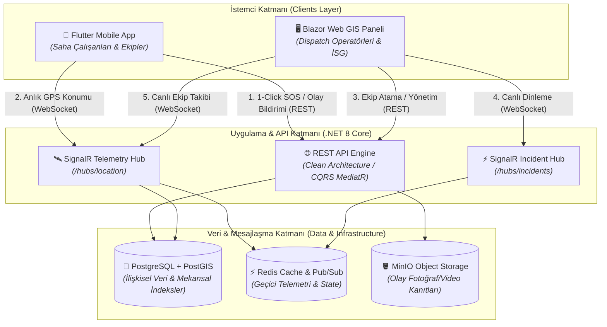

<p align="center">
  
</p>

<h1 align="center">SOCAR Dispatch — Real-Time Emergency Response & Fleet Dispatch System</h1>

<p align="center">
  <strong>Endüstriyel tesisler, rafineriler ve yüksek riskli saha operasyonları için yeni nesil acil durum yönetimi, telemetri ve sevk ekosistemi.</strong>
</p>

<p align="center">
  <a href="https://github.com/Decuayer/socar-dispatch/actions/workflows/backend-ci.yml">
    
  </a>
  <a href="https://github.com/Decuayer/socar-dispatch/actions/workflows/mobile-ci.yml">
    
  </a>
  
  
  
  
  
</p>

---

## 📌 Problem & Çözüm Özeti (Executive Summary)

### Karşılaşılan Zorluklar
SOCAR rafineri sahaları (ör. STAR Rafinerisi, Petkim yerleşkeleri) gibi yüksek riskli endüstriyel alanlarda kimyasal sızıntı, yangın veya iş kazası gibi acil durumlarda:
* Geleneksel telsiz/telefon anonslarının konum hassasiyetinden yoksun olması,
* Müdahale ekiplerinin sahadaki anlık konumlarının ve uygunluk durumlarının merkezden izlenememesi,
* Olay yeri görsel/video verilerinin koordinasyon merkezine dakikalar sonra ulaşması,
* Müdahale süresini uzatarak iş sağlığı ve güvenliği (İSG) risklerini artırmaktadır.

### SOCAR Dispatch Çözümü
**SOCAR Dispatch**, saha personeli, acil müdahale ekipleri ve koordinasyon operatörleri arasındaki operasyonel halkayı milisaniyeler seviyesine indiren uçtan uca kurumsal bir yönetim platformudur:
* **Hızlı Müdahale (1-Click SOS):** Çalışanlar tek tuşla GPS koordinatlı, kategori kodlu acil durum çağrısı ve kanıt medyası gönderir.
* **Canlı Durumsal Farkındalık:** Operatörler interaktif GIS harita üzerinden olay koordinatlarını ve sahadaki timlerin telemetri verilerini gerçek zamanlı izler.
* **Dinamik Sevk ve Takip:** Operatörler olaylara en yakın ve uygun ekibi yönlendirir; saha ekibi rota rehberliği alırken durumunu (Yönlendi, Olay Yerinde, Çözüldü) tek tuşla günceller.

---

## 🏛️ Mimari Şema ve Veri Akışı (System Architecture)

Sistem; mikroservis hazırlığında Clean Architecture ve CQRS prensiplerine göre yapılandırılmış bir **.NET 8 Web API**, gerçek zamanlı iki yönlü iletişim sağlayan **SignalR WebSockets**, jeouzamsal indeksleme ve sorgulama yetenekli **PostgreSQL / PostGIS** altyapısı üzerine inşa edilmiştir.



---

## 🚀 Öne Çıkan Özellikler (Core Features)

* 🛡️ **Role-Based Access Control (RBAC):** `Employee`, `Team`, `Operator` rolleri ve departman bazlı yetki matrisi (JWT & Refresh Token).
* 🚨 **1-Click Rapid Emergency Dispatch:** Panik anında tek dokunuşla arka planda GPS konum sabitleme ve olay kodu iletimi.
* 📍 **Geofencing & Facility Boundary Lock:** Operatör ve mobil haritalarının rafineri sınırlarına kilitlenmesi, sınır aşımı engeli.
* 📡 **Sub-Second SignalR Telemetry:** Ekiplerin hareket halinde gönderdiği koordinatların operatör ekranına < 1s gecikmeyle yansıması.
* 👥 **Team Discovery & Leadership Succession:** Boştaki timleri keşfetme, kendi isteğiyle katılma/ayrılma ve boşalan liderliği devralma mekanizmaları.
* 📸 **Kanıt Medya Boru Hattı:** MinIO entegrasyonuyla çoklu fotoğraf ve video ekleme, küçük resim (thumbnail) önizleme desteği.

---

## 🛠️ Teknoloji Yığını (Tech Stack)

| Katman | Teknoloji | Açıklama |
| :--- | :--- | :--- |
| **Backend Core** | .NET 8 (C#) | Clean Architecture, CQRS (MediatR), FluentValidation |
| **Real-Time Hub** | ASP.NET Core SignalR | Düşük gecikmeli olay ve telemetri yayını (WebSocket) |
| **Veritabanı & GIS** | PostgreSQL 16 + PostGIS | Coğrafi sorgular (`ST_DWithin`, `ST_Distance`), B-Tree dizinleri |
| **Önbellek / Dağıtık Durum** | Redis | Canlı oturum ve telemetri durum önbelleği |
| **Nesne Depolama** | MinIO (S3-Compatible) | Saha olay fotoğrafları ve operasyonel video kayıtları |
| **Mobil İstemci** | Flutter (Dart) | iOS & Android, Arka Plan Konum Servisi, Offline Fallback |
| **Web Operatör Paneli** | Blazor Web (.NET 8) + Leaflet | Interaktif GIS harita paneli, olay ve filo yönetim masası |
| **Konteynerizasyon** | Docker & Docker Compose | İzole, tekrarlanabilir çoklu servis geliştirme ortamı |

---

## ⚡ Hızlı Başlatma (Quick Start)

### 1. Ön Koşullar (Prerequisites)
* [.NET 8 SDK](https://dotnet.microsoft.com/download/dotnet/8.0)
* [Flutter SDK (v3.22+)](https://flutter.dev/docs/get-started/install)
* [Docker Desktop](https://www.docker.com/products/docker-desktop)
* [Git](https://git-scm.com/)

---

### 2. Altyapı Servislerini Ayağa Kaldırma (Docker)
PostgreSQL/PostGIS, Redis ve MinIO servislerini başlatmak için:

```bash
# Repoyu klonlayın
git clone https://github.com/Decuayer/socar-dispatch.git
cd socar-dispatch

# Ortam değişkenlerini hazırlayın
cp .env.example .env

# Veritabanı ve altyapı konteynerlerini başlatın
docker compose -f docker/docker-compose.yml up -d
```

---

### 3. Backend API'yi Başlatma

```bash
# Backend dizinine geçin
cd backend

# Bağımlılıkları geri yükleyin ve veritabanı migrasyonlarını uygulayın
dotnet restore
dotnet ef database update --project src/SocarDispatch.Infrastructure --startup-project src/SocarDispatch.API

# Web API'yi başlatın
dotnet run --project src/SocarDispatch.API
```
> API Varsayılan Adresi: `https://localhost:7001` veya `http://localhost:5001`  
> Swagger UI Dokümantasyonu: `https://localhost:7001/swagger`

---

### 4. Flutter Mobil Uygulamasını Başlatma

```bash
# Mobil dizinine geçin
cd clients/mobile

# Paketleri yükleyin
flutter pub get

# Cihaz veya simülatörde çalıştırın
flutter run
```

---

### 5. Web Operatör Panelini Başlatma

```bash
# Web dizinine geçin
cd clients/web/SocarDispatch.Web

# Blazor uygulamasını başlatın
dotnet run
```
> Web Paneli Varsayılan Adresi: `https://localhost:7100`

---

## 🧪 Testlerin Çalıştırılması

```bash
# Backend birim ve entegrasyon testleri
cd backend
dotnet test --verbosity normal

# Flutter mobil birim testleri
cd ../clients/mobile
flutter test
```

---

## 🔒 Güvenlik & KVKK Uyumluluğu
Bu proje endüstriyel tesis güvenlik standartlarına (ISO 27001 / IEC 62443 hedefleri) ve KVKK yönetmeliklerine uygun olarak geliştirilmektedir. Konum takibi yalnızca aktif görev ve açık rıza onay mekanizması çerçevesinde gerçekleştirilir.

---

<p align="center">
  Developed with ❤️ for <strong>SOCAR Operations</strong> by <a href="https://github.com/Decuayer">Demir Cücü</a>
</p>
