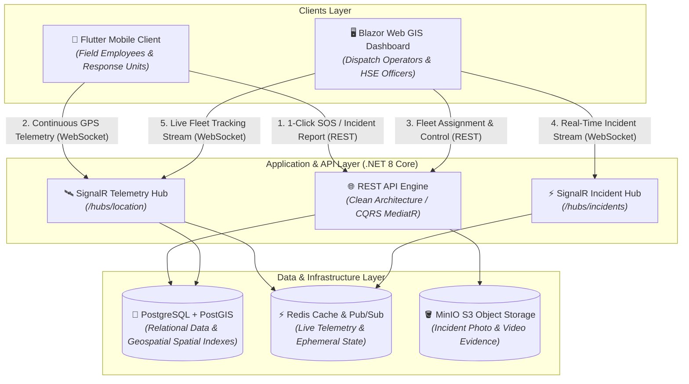

<p align="center">
  
</p>

<h1 align="center">SOCAR Dispatch — Real-Time Emergency Response & Fleet Dispatch Ecosystem</h1>

<p align="center">
  <strong>An enterprise-grade emergency management, geospatial telemetry, and rapid incident dispatch system tailored for oil refineries, chemical plants, and high-risk industrial facilities.</strong>
</p>

<p align="center">
  <a href="https://github.com/Decuayer/socar-dispatch/actions/workflows/backend-ci.yml">
    
  </a>
  <a href="https://github.com/Decuayer/socar-dispatch/actions/workflows/mobile-ci.yml">
    
  </a>
  
  
  
  
  
</p>

---

## 📌 Executive Summary

### The Challenge
In high-consequence industrial facilities (such as the STAR Refinery and Petkim petrochemical complexes), every second counts during critical incidents like hazardous gas leaks, industrial fires, structural failures, or personal injury:
* Conventional radio dispatch and phone calls lack geospatial precision and real-time telemetry.
* Incident dispatchers struggle to identify field unit proximity and live operational status.
* Visual proof and damage documentation reach crisis command centers with significant latency.
* These inefficiencies amplify response times and elevate occupational health and safety (OHS) risks.

### The SOCAR Dispatch Solution
**SOCAR Dispatch** unifies field workers, emergency response units (ERT), and central dispatch operators into a synchronized, sub-second telemetry network:
* **1-Click SOS Reporting:** Field workers trigger immediate, GPS-tagged emergency dispatches with categorized emergency codes and multimedia proof in a single tap.
* **Real-Time Situational Awareness:** Dispatchers monitor live incident coordinates and responder telemetry pins on an interactive GIS map.
* **Dynamic Fleet Dispatch & Telemetry:** Dispatchers assign the nearest available response unit; responders receive route intelligence and update their tactical status (`En Route`, `On Scene`, `Resolved`) seamlessly.

---

## 🏛️ System Architecture & Data Flow

The platform is designed following Clean Architecture and CQRS principles atop **.NET 8 Core**, real-time bidirectional **SignalR WebSockets**, and a geospatial **PostgreSQL / PostGIS** database cluster.



---

## 🚀 Core Features

* 🛡️ **Role-Based Access Control (RBAC):** Strict isolation and role hierarchies (`Employee`, `Team`, `Operator`) backed by secure JWT & Refresh Token lifecycle.
* 🚨 **1-Click Rapid Emergency Dispatch:** Rapid incident triggers that capture background GPS location and broadcast priority alarms immediately.
* 📍 **Geofencing & Facility Boundary Lock:** Boundary-locked Leaflet and mobile maps ensuring operator and responder focus stays within refinery coordinates.
* 📡 **Sub-Second SignalR Telemetry:** Low-latency GPS broadcast pipeline updating responder coordinates across web dispatch consoles in under 1 second.
* 👥 **Team Discovery & Succession Hierarchy:** Discovery of idle response teams, self-join/leave workflows, and vacant leadership succession protocols.
* 📸 **Multimedia Evidence Pipeline:** High-throughput photo and video attachments stored on S3-compatible MinIO storage with thumbnail generation.

---

## 🛠️ Technology Stack

| Component | Technology | Description |
| :--- | :--- | :--- |
| **Backend Core** | .NET 8 (C#) | Clean Architecture, CQRS (MediatR), FluentValidation, EF Core |
| **Real-Time Hubs** | ASP.NET Core SignalR | High-throughput, sub-second WebSocket telemetry & broadcast |
| **Database & GIS** | PostgreSQL 16 + PostGIS | Spatial queries (`ST_DWithin`, `ST_Distance`), composite B-Tree indexes |
| **Cache & Distributed State** | Redis | Ephemeral telemetry caching and Pub/Sub communication |
| **Object Storage** | MinIO (S3-Compatible) | High-durability incident evidence attachments (Photos & Videos) |
| **Mobile Client** | Flutter (Dart) | iOS & Android, background location telemetry, offline resilience |
| **Web Operator Console** | Blazor Web (.NET 8) + Leaflet | Interactive GIS mapping console, incident queue, and fleet telemetry |
| **Containerization** | Docker & Docker Compose | Isolated multi-service production & development environments |

---

## ⚡ Quick Start

### 1. Prerequisites
* [.NET 8 SDK](https://dotnet.microsoft.com/download/dotnet/8.0)
* [Flutter SDK (v3.22+)](https://flutter.dev/docs/get-started/install)
* [Docker Desktop](https://www.docker.com/products/docker-desktop)
* [Git](https://git-scm.com/)

---

### 2. Launch Infrastructure Services (Docker)
Spin up PostgreSQL/PostGIS, Redis, and MinIO with a single command:

```bash
# Clone the repository
git clone https://github.com/Decuayer/socar-dispatch.git
cd socar-dispatch

# Copy the environment file
cp .env.example .env

# Start infrastructure containers
docker compose -f docker/docker-compose.yml up -d
```

---

### 3. Run Backend API

```bash
# Navigate to backend directory
cd backend

# Restore packages and apply EF Core database migrations
dotnet restore
dotnet ef database update --project src/SocarDispatch.Infrastructure --startup-project src/SocarDispatch.API

# Run the API
dotnet run --project src/SocarDispatch.API
```
> API Default URL: `https://localhost:7001` or `http://localhost:5001`  
> Swagger Documentation: `https://localhost:7001/swagger`

---

### 4. Run Flutter Mobile App

```bash
# Navigate to mobile client directory
cd clients/mobile

# Get dependencies
flutter pub get

# Run on connected device or simulator
flutter run
```

---

### 5. Run Web Dispatch Operator Console

```bash
# Navigate to web client directory
cd clients/web/SocarDispatch.Web

# Launch Blazor application
dotnet run
```
> Web Console Default URL: `https://localhost:7100`

---

## 🧪 Running Automated Tests

```bash
# Run backend unit and integration test suite
cd backend
dotnet test --verbosity normal

# Run Flutter mobile unit and widget tests
cd ../clients/mobile
flutter test
```

---

## 🔒 Security & Compliance
This solution is engineered to align with industrial facility safety benchmarks (ISO 27001 / IEC 62443 principles) and local data privacy standards (KVKK / GDPR). Continuous location tracking is activated strictly upon explicit consent and during active emergency duty states.

---

<p align="center">
  Developed with ❤️ for <strong>SOCAR Operations</strong> by <a href="https://github.com/Decuayer">Demir Cücü</a>
</p>
